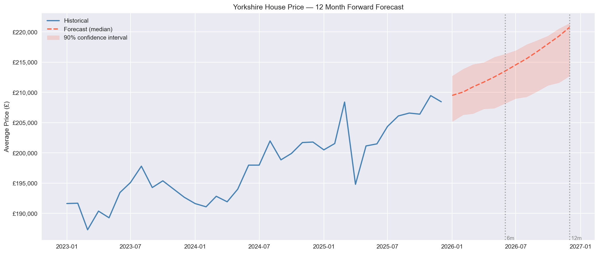
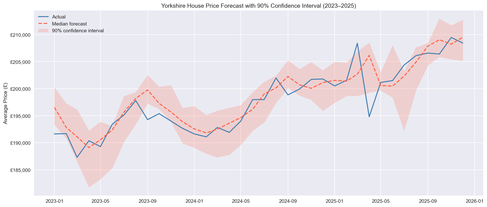

# UK House Price Forecasting - Yorkshire and The Humber

A time series forecasting project using ONS UK House Price Index data to predict 
regional house prices 6 and 12 months ahead, with uncertainty quantification via 
quantile regression.

Built as a portfolio project to explore how risk and economics teams think about 
forward-looking economic exposure.

---

## Headline Output

> "In 12 months (Dec 2026), the average house price in Yorkshire and The Humber 
> is forecast to be **£220,755**, with a 90% confidence interval of 
> **£212,726 - £221,408**."



---

## Methodology

**Data:** ONS UK HPI full file — monthly average prices from 1995 to Dec 2025 
for Yorkshire and The Humber.

**Features engineered:**
- Lag features (1, 3, 6, 12 months)
- Rolling averages (3, 6, 12 months)
- Year-on-year % change
- Month, quarter, year

**Model selection:** I tested both linear regression and XGBoost. XGBoost failed 
to extrapolate beyond its training range — a known limitation on strongly trending 
time series — so linear regression was selected as the final model. The baseline 
actually performed well, which reflects the largely trend-driven nature of UK 
regional house prices.

**Confidence intervals:** Quantile regression trained at the 5th, 50th, and 95th 
percentiles, producing a 90% prediction interval around each forecast.

---

## Results

| Horizon | Central Forecast | 90% CI |
|---------|-----------------|--------|
| 6 months (Jun 2026) | £213,528 | £208,190 - £216,330 |
| 12 months (Dec 2026) | £220,755 | £212,726 - £221,408 |

**Test set performance (2023-2025):**
- MAE: £1,930
- R²: 0.77



---

## Project Structure
```
uk-housing-prediction/
│
├── data/                  # raw ONS HPI data (not tracked in git)
├── notebooks/
│   ├── 01_eda.ipynb       # data loading, cleaning, decomposition
│   └── 02_features.ipynb  # feature engineering, modelling, forecasting
├── src/                   # clean versions of pipeline (coming soon)
├── assets/                # charts for README
├── requirements.txt
└── README.md
```

---

## Setup
```bash
git clone https://github.com/olivercdavies-su/UK-House-Price-Forecasting
cd UK-House-Price-Forecasting
pip install -r requirements.txt
```

Download the ONS UK HPI full file from:
https://www.ons.gov.uk/economy/inflationandpriceindices/datasets/housepriceindex

Save it to `data/` and run the notebooks in order.

---

## Key Learnings

- XGBoost is a poor fit for strongly trending time series without stationarity 
  transformations — linear regression outperformed it significantly on this data
- Quantile regression is a clean, interpretable approach to uncertainty 
  quantification that mirrors how risk teams think about forecast ranges
- The post-2020 covid volatility is a genuine modelling challenge — residuals 
  are 3x larger in that period than the pre-2020 baseline

---

## Data Source

Office for National Statistics — UK House Price Index  
https://www.ons.gov.uk/economy/inflationandpriceindices/datasets/housepriceindex
